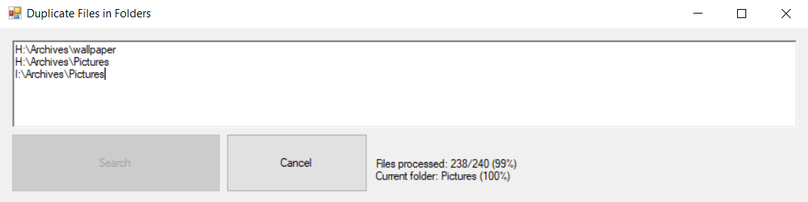
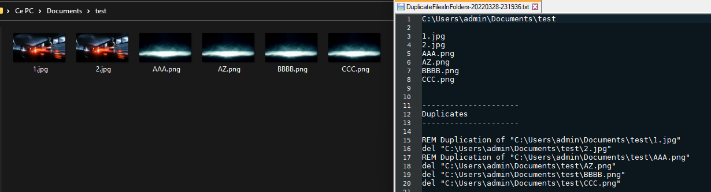

# Find and delete duplicate files from one or more directories

This ***Windows*** tool verifies the ***MD5 checksum*** of every files from the directories (**and their subdirectories!**) you give as input.  
It will produce a .txt report indicating :
- Every files analysed
- Every duplicates found with :
  - one line formatted as "REM" (= remark) statement for CMD, it's purpose is to indicate that this file is duplicated by the file(s) below. That one won't be deleted
  - at least one line formatted as "DEL" (= delete) statement for CMD, on every duplicates

That way you are free to check manually the duplicates before effective deletion.  
The deletion can be done by pasting the whole statements into [CMD](https://en.wikipedia.org/wiki/Cmd.exe).

`The report will be created in the same folder from wich the .exe is run.`

# Requirements

[Microsoft .NET runtime 4.8 or higher](https://dotnet.microsoft.com/en-us/download/dotnet-framework/net48) (the project can be rebuild with a lower version).

# Screenshots

  
*The application is analysing every directories and subdirectories of given paths*  
*"Files processed" defines the global progress (total files processed / total files to process)*    
*"Current folder" defines the progress of current folder being processed*

  
*The report firstly lists all analysed files*  
*Then, the duplications are written at the bottom of the file, with the ability to copy/paste the whole instructions to delete every duplications*

  
*The folder(s) is/are cleaned from duplications*

# Download

Please visit the [release](https://github.com/a-blondel/DuplicateFilesInFolders/releases/) page.

# License

See the [MIT License](LICENSE.txt) file for license rights and limitations.
